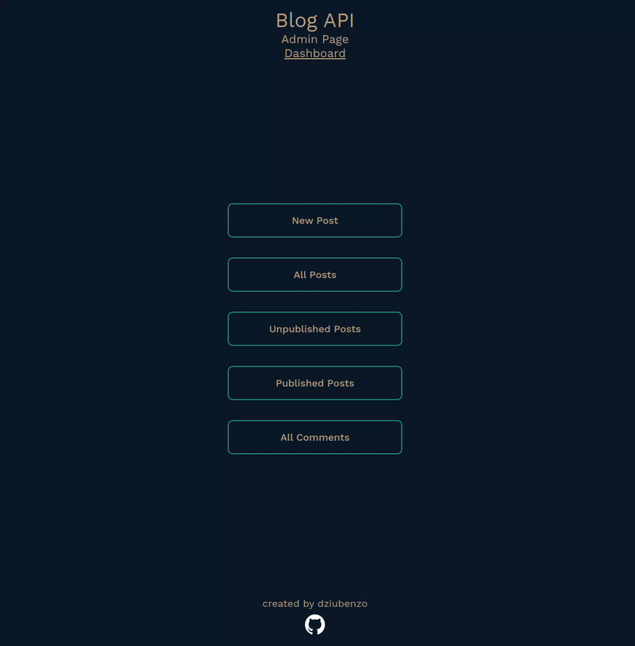

# Odin Project - Blog API (Admin)

An admin site for the Blog API project.

## Features

- Authentication based on JWT
- Create posts using [Quill](https://quilljs.com/) rich text editor and [react-quill](https://github.com/zenoamaro/react-quill) (its React implementation)
- View, edit and delete posts
- Publish all unpublished posts
- Unpublish all published posts
- View, edit and delete posts
